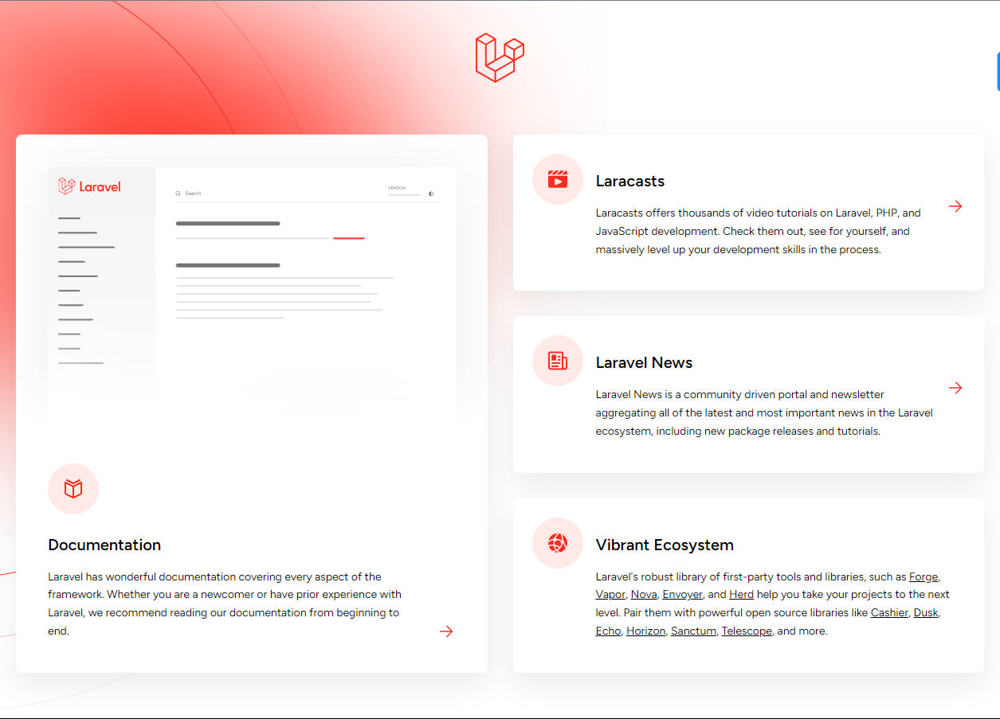

# Laravel React

[laravel docs inertia](https://laravel.com/docs/11.x/frontend#inertia)

[inertia js](https://inertiajs.com/)

[inertia laravel react demo](https://github.com/Landish/pingcrm-react)

## [Installation](https://bootcamp.laravel.com/inertia/installation)

Create new laravel project

```bash
    composer create-project laravel/laravel chirper
```

Update database credentials and config

```txt
DB_CONNECTION=pgsql
DB_HOST=127.0.0.1
DB_PORT=5433
DB_DATABASE=laravel
DB_SCHEMA=react
DB_USERNAME=[username]
DB_PASSWORD=[password]
```

```php
# config/database.php

...
   'pgsql' => [
            'driver' => 'pgsql',
            'url' => env('DB_URL'),
            'host' => env('DB_HOST', '127.0.0.1'),
            'port' => env('DB_PORT', '5432'),
            'database' => env('DB_DATABASE', 'laravel'),
            'username' => env('DB_USERNAME', 'root'),
            'password' => env('DB_PASSWORD', ''),
            'charset' => env('DB_CHARSET', 'utf8'),
            'prefix' => '',
            'prefix_indexes' => true,
            'search_path' => env('DB_SCHEMA', 'public'), # <-- Change this line
            'sslmode' => 'prefer',
        ],

...

```

Run migrations and start server

```bash
    cd chirper
    php artisan migrate: fresh
    php artisan serve
```

View site at [http://127.0.0.1:8000/](http://127.0.0.1:8000/)



## User Authentications with Breeze

```bash
    composer require laravel/breeze --dev
 
    node --version # use node version 18+

    php artisan breeze:install react

    npm run dev
```

Visit [http://127.0.0.1:8000/register](http://127.0.0.1:8000/register)
Register a new user

[breeze registration page](./assets/images/breeze-registration.png)

## crud

### [create](https://bootcamp.laravel.com/inertia/creating-chirps)

Create a Model, Migration, and Controller for Chirps

```bash
     php artisan make:model --help
```

```bash
Description:
  Create a new Eloquent model class

Usage:
  make:model [options] [--] <name>

Arguments:
  name                  The name of the model

Options:
  -a, --all             Generate a migration, seeder, factory, policy, resource controller, and form request classes for the model
  -c, --controller      Create a new controller for the model
  -f, --factory         Create a new factory for the model
      --force           Create the class even if the model already exists
  -m, --migration       Create a new migration file for the model
      --morph-pivot     Indicates if the generated model should be a custom polymorphic intermediate table model
      --policy          Create a new policy for the model
  -s, --seed            Create a new seeder for the model
  -p, --pivot           Indicates if the generated model should be a custom intermediate table model
  -r, --resource        Indicates if the generated controller should be a resource controller
      --api             Indicates if the generated controller should be an API resource controller
  -R, --requests        Create new form request classes and use them in the resource controller
      --test            Generate an accompanying Test test for the Model
      --pest            Generate an accompanying Pest test for the Model
      --phpunit         Generate an accompanying PHPUnit test for the Model
  -h, --help            Display help for the given command. When no command is given display help for the list command
  -q, --quiet           Do not output any message
  -V, --version         Display this application version
      --ansi|--no-ansi  Force (or disable --no-ansi) ANSI output
  -n, --no-interaction  Do not ask any interactive question
      --env[=ENV]       The environment the command should run under
  -v|vv|vvv, --verbose  Increase the verbosity of messages: 1 for normal output, 2 for more verbose output and 3 for debug
```

```bash
    php artisan make:model -mrc Chirp

    # OUTPUT
   INFO  Model [app/Models/Chirp.php] created successfully.
   INFO  Migration [database/migrations/2024_04_15_021251_create_chirps_table.php] created successfully.
   INFO  Controller [app/Http/Controllers/ChirpController.php] created successfully.
```

```php
# App\Models\Chirp.php
<?php

namespace App\Models;

use Illuminate\Database\Eloquent\Factories\HasFactory;
use Illuminate\Database\Eloquent\Model;

class Chirp extends Model
{
    use HasFactory;
}

# App\Http\Controllers\ChirpController.php
<?php

namespace App\Http\Controllers;

use App\Models\Chirp;
use Illuminate\Http\Request;

class ChirpController extends Controller
{
    /**
     * Display a listing of the resource.
     */
    public function index()
    {
        //
    }

    /**
     * Show the form for creating a new resource.
     */
    public function create()
    {
        //
    }

    /**
     * Store a newly created resource in storage.
     */
    public function store(Request $request)
    {
        //
    }

    /**
     * Display the specified resource.
     */
    public function show(Chirp $chirp)
    {
        //
    }

    /**
     * Show the form for editing the specified resource.
     */
    public function edit(Chirp $chirp)
    {
        //
    }

    /**
     * Update the specified resource in storage.
     */
    public function update(Request $request, Chirp $chirp)
    {
        //
    }

    /**
     * Remove the specified resource from storage.
     */
    public function destroy(Chirp $chirp)
    {
        //
    }
}

# Database\Migrations\_create_chirps_table.php
<?php

use Illuminate\Database\Migrations\Migration;
use Illuminate\Database\Schema\Blueprint;
use Illuminate\Support\Facades\Schema;

return new class extends Migration
{
    /**
     * Run the migrations.
     */
    public function up(): void
    {
        Schema::create('chirps', function (Blueprint $table) {
            $table->id();
            $table->timestamps();
        });
    }

    /**
     * Reverse the migrations.
     */
    public function down(): void
    {
        Schema::dropIfExists('chirps');
    }
};

```

### [read](https://bootcamp.laravel.com/inertia/showing-chirps)

### [update](https://bootcamp.laravel.com/inertia/editing-chirps)

### [delete](https://bootcamp.laravel.com/inertia/deleting-chirps)

## [notification and events](https://bootcamp.laravel.com/inertia/notifications-and-events)
